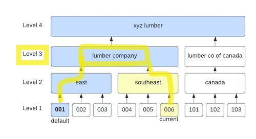

# OPA - Branch Hierarchy Security

This repository contains the `rego` and json data to
model ~~all~~ _some_ of the examples in the [abc branch security presentation](https://dmsi.sharepoint.com/:v:/r/development/Security%20Admin/Branch%20Hierarchy-Security%20project/Branch%20Hierarchy-Enhanced%20Security%20Overview.mp4?csf=1&web=1) (warning: video).

This repo does not demonstrate the use of `opa` as an agent or sidecar process. It does not
demonstrate any data syncing or API usage.

## Usage

You'll need to install opa v0.43.0 from [here](https://github.com/open-policy-agent/opa/releases/tag/v0.43.0).

## Algorithm

### The Data
1. `org_chart_data` for a company. The org chart is a [DAG](https://en.wikipedia.org/wiki/Directed_acyclic_graph).   
   Leaf nodes are called `branches` (as in, "Scranton Branch"). 
   A `level` is the depth of a node _as measured from the leaf nodes_. A branch is level 1, by definition.
2. `role_data`, which contains a tree, `role -> securable_object -> level -> security_level`. A 
   `securable_object` in these examples are screens in an application. They could also be actual entities from
   an application's data model. A `security_level` is one of 4 values, "full", "read_only", "limited", and null/none (we might call these 
   "permissions" in other contexts).
4. A `user` who has 
   1. `allowed_branches`, which are the branches the user is allowed to visit.
   2. `default_branch`, the user's regular branch.
   3. `current_branch`, which is another branch they may be working "in".

### Effective Level

We define the `effective_level` as the `level` of the first intersection between two paths:

1. The path from the user's `default_branch` to the root node.
2. The path from the user's `current_branch` to the root node.



_Example: If a user's default branch is `001` and their current branch is `006`, then the two paths back to the root node 
intersect at "lumber company", so the effective level is 3._

### Philosophy

We don't have an explicit `deny` as a value (at least, within the innards of the system - we could add a top-level default).
This is because as we search the user's roles, we are looking for explicit permissions and accumulating
them as we go. One could read "deny" as an explicit override, rather than simply _not_ having the permission.

This is debatable, but it's what I did here.

### Role and Security Level Definitions

A role has a set of `securable_objects`, each of which has a `security_level` for each `level`.


_Example: a user with roles SALES3 and VIEWER-REPORTS.
If the user's current branch is `006`, then her effective branch, using the org chart above, is "lumber company",
which is at level 3. So her candidate permissions on "sales order entry screen" are  `read_only` and `full`. 
The algorithm should pick the most permissive, so she would get `full` access._
## Eval

You can evaluate different expressions from the command line. 
We will pass two files in.

1. [input.yaml](input.yaml), which models data you pass to opa, e.g. username and branch. In practice, the input data may be a JWT, entitlements from ADFS, LDAP attributes, etc.
2. [data.yaml](data.yaml), which is data stored in the agent. This is data you would sync out to the agents. In this example, it includes
   - `user_data` - the user's roles and default branch
   - `org_chart_data` - a DAG of the org chart
   - `role_data` - roles, securable_objects, and the security_level for each level

You can modify the values in [input.yaml](input.yaml) to mimic different `current_branch` scenarios.


### Eval Examples
```shell
opa eval -b . -f pretty -d data.yaml -i input.yaml 'data.branch_hierarchy.effective_security_level'
```

Output:
```json
{
  "CM_ENTRY": "read_only",
  "PRINT_ACKNOWLEDGEMENTS": "full",
  "SO_ENTRY": "read_only"
}
```

### Example Rules

```
data.branch_hierarchy.effective_security_levels
data.branch_hierarchy.effective_security_level.SO_ENTRY
data.branch_hierarchy.effective_security_level.CM_ENTRY
data.branch_hierarchy.effective_security_level["SO_ENTRY"]
data.branch_hierarchy.user_permissions
```

## The REPL

You can interactively work with policies in opa's repl. Tab-completion is available (start with `data`).

```
make repl
```


## Unit Tests

```
opa test . -v
```

## Actors and Architecture

If you're bolting this onto a monolith, you might have something like this. 

> edit: I have no idea what I'm talking about here.


- Admins manage the org chart and roles.
- Developers write policies.
- Use any data store to hold the authoritative org chart, role, and (possibly) user data. 
- Push or pull data into the agent.
- Implementation of the data store is loosely coupled to the OPA interfaces.
- Use a separate identity provider, or not. OPA doesn't care.

## Related Links

- [OPA Policy Reference](https://www.openpolicyagent.org/docs/v0.43.0/policy-reference/)
- [OPA Policy Language](https://www.openpolicyagent.org/docs/v0.43.0/policy-language/)
